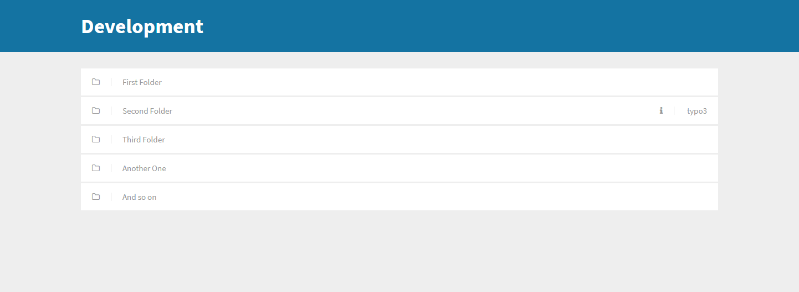

# Simple-Server-Explorer

Just put the index.php in the directory where you want do show all other directories and you're ready :)

(If one of the directories has an typo3 installation, there will be a simple information marker)

## Preview

